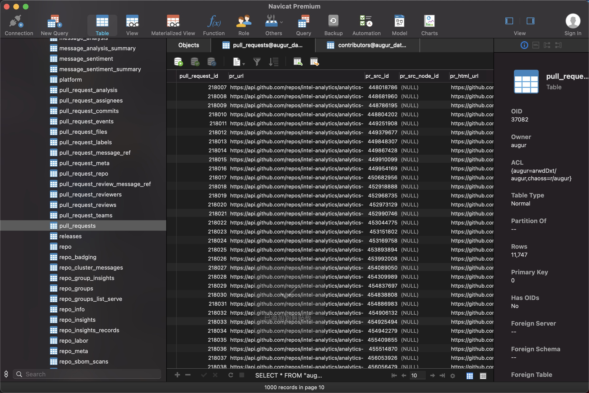
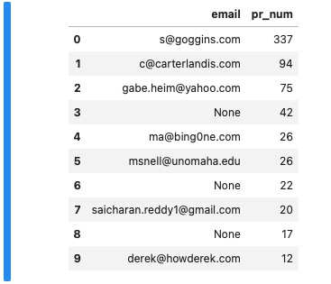

Augur micro-task for GSoC 2021
==

GSoC Idea: [Advancing Risk Prediction With Machine Learning in Augur](https://github.com/chaoss/augur/issues/1179)

Microtasks:
  - 

- Microtask 0: 
Download and configure Augur, creating a dev environment
I have installed Augur in dev mode with command `make install-dev`.
 
- Microstask 1:
Work on any Augur Issue that's Open
 I'm trying to!
  
- Microtask 2:
Identify new issues you encounter during installation.
My issues: [#1](https://github.com/chaoss/augur/issues/1228), [#2](https://github.com/chaoss/augur/issues/912), [#3](https://github.com/chaoss/augur/issues/1227)
 
- Microstask 3:
Collection data with an existing machine learning worker

more than 40K data about LFAI
 

- Microtask 4:
Anything you want to show us. Even if you find bugs in our documentation and want to issue a PR for those!
 

I made a simple report to show the Top10 active developers by measuring their numbers of PR using [augur-community-reports](https://github.com/chaoss/augur-community-reports).
 
You can also see my result in the [Jupyter Notebook](./Top10_pull_request_developers_in_augur.ipynb). But it seems that the mailbox display is incomplete due to lack of data.
